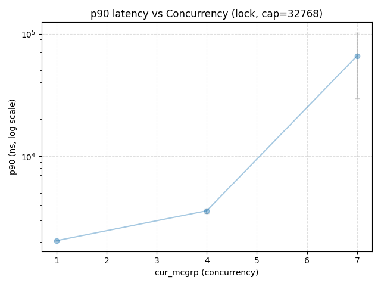
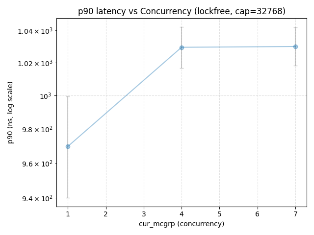
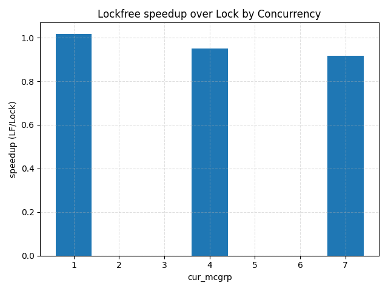
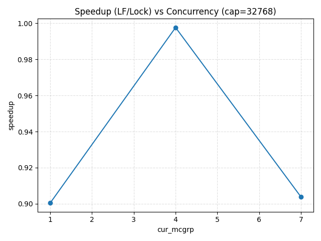

# Lock vs Lock-Free Multi-producer/Multi-consumer Queue: Implementation & Performance Evaluation

## Overview
This repository provides a hobbists implementation of the classical multi-producer/multiconsumer (MPMC) concurrency scenario.
Two approaches were taken to achieve both synchronization and maximal concurrent gain: a **lock-based** and a **lock-free** buffer. 
Aside from theory, the goal is to understand how synchronization design choices affect **throuhgput** and **latency under load** in realistic
message-passing workloads (e.g., market data ingestion pipelines).

## Relevant Theory & Terminology 
### Blocking algorithms
These are the most easily introduced approaches to data synchronization problems: using OS-level primitives and locking structures to encapsulate regions where some
shared memory point is being operated on, i.e., **critical regions**. Employing `std::mutex`, `std::counting_semaphore`, and `std::condition_variable` in C++ contexts
are typically viable implementations to avoid data races between multiple threads. 

However, contention, priority inversion, and the blackbox of kernel scheduling makes these choice suboptimal if the desire is to maximize concurrency and/or avoid system
deadlock/maintain system up-time. Blocking algorithms **do not guarantee forward progress**. A blocked/interrupted/terminated thread may prevent system-wide forward progress
till the system is manually reset from such a state. Threads can unexpectedly terminate due to timeouts, fatal failures or by operator's command. In such systems mutexes are 
inherently unsafe to use. 

### Lock-freedom
Lock-freedom means that **a system as a whole** moves forward regardless of anything (recognize the emphasis on "system as a whole"; wait-freedom guarantee's forward progress on each thread, but furhter information on that is beyond my knowledge). Contrary to how blocking algorithms may have another thread prevent progress on the entire system, lock-freedom 
avoids this by eliminating the power of mutual-exclusion through locks and making use of architecture specific atomic instructions. Atomic in this context is an instruction 
provided by the ISA that is **indivisible**. Such instructions include `compare_and_swap` and `test_and_set`. `bool std::atomic<T>::compare_exchange_weak(T& expected, T desired)` is what is primarily used in implementing C++ lockfree procedures. The instruction name illustrates its functionality:
```
if current is equal to expected 
    current = desired
    return true
else
    return false
```
This naively contrived pseudocode fails to highlight the significance of such an instruction, so I will verbalize: the comparison operation and store operation are atomic/indivisible, they either happen together or don't. Proves critical when a thread attempts to secure that its current view of a certain memory location is synchrones with the entire system's 
view. An example of a lockfree algorithm is shown below:
```
void stack_push(std::atomic<node>* s_head, node* n){
    node* head;
    do{
        head = s_head;
        n->next = head;
    }while(!s_head.compare_exchange(head, n));
}
```
This code effectively ensures that prior to appending a new head to the "perceived" head, the actual stack head has not been changed by other threads appending to the stack. Note,
a thread can "spin" in the cycle theoretically infinitely, but every repeat of the cycle means that some other thread had made forward progress (via appending to the stack).
A blocked/interrupted/terminated thread can not prevent forward progress of other threads. Consequently, the system as a whole makes forward progress.
### Performance/scalability
Just because an algorithm is lockfree does not guarantee lower latency compared to its blocking counterpart. The terms are about forward progress guarantees, and are orthogonal
to performance. Of course, some lockfree algorithms are faster than mutex-based algorithms, but only be coincedence. Therefore, deciding between which approach should primarily be 
based on the need for guaranteed forward progress, i.e., the system's work progress is independent from a threads failure. 

**My study into this subject manner is, therefore, primarily based on curiousity regarding these approaches and modern C++ specific features (e.g., C++ memory model, std::thread library, etc.) involved with developing robust concurrent applications.** Prior to completing this I was aware that there may be no inherent performance gain from converting to lockfree 
and lock-freedom is a niche solution for ultra-niche problems.

## Data Pipeline 

### 1) Simulation (Traffic Generator)
- **Topology:** N UDP multicast *senders* → N UDP *receivers* threads -> MPMC ring buffer -> M FIX *processor* threads.
- **Payloads:** FIX-style, fixed schema; strictly bounded packet size per run to keep MTU effects stable.
- **Scheduling:** Sender emits bursts on each multicast group to create fan-in pressure on the queues.
- **Repeatability:** Each run is tagged by `seed`, which controls packet ordering and symbol mix.
- **OS/Socket knobs:** `IP_ADD_MEMBERSHIP` to join groups.

### 2) Queueing Layer (Device Under Test)
Each receiver thread enqueues into one of two MPMC implementations:

- **Lock-based MPMC:** classical ring + `std::counting_semaphore`. Simple and easy to reason about; susceptible to convoying and scheduler noise under contention.
- **Lock-free MPMC:** ring with per-cell sequence numbers + atomics/CAS on head/tail tickets. No kernel locks; progress is guaranteed for the *system* (lock-freedom).

**Capacity control:** `capacity` is a power-of-two ring size (e.g., 4096, 32768).  
**Concurrency control:** `cur_mcgrp` is the main load knob—the number of active multicast groups/receivers (and thus producer threads).

### 3) Processing Stage (Back-pressure + Realism)
Worker threads dequeue and do a small, deterministic “work token” (e.g., parse + minimal accounting). This:
- creates realistic contention on the queue,
- prevents the benchmark from degenerating into pure memory bandwidth,
- allows tail behavior (p90/p99) to emerge under pressure.

### 4) Windowing & Metrics (What the CSVs Contain)
The receiver emits *windowed* stats with a fixed window size of **100 ms**.

Per row/“window” (across all active symbols in that window), the CSV (`./results/raw`) includes:

- **Time bounds:** `ts_start_ns`, `ts_end_ns`, and a `window_id` (strictly increasing within a run).
- **Throughput input:** `recv_count` = number of packets received in that window (post-kernel, pre-parse).
- **Queue wait latencies:** `qwait_p50_ns`, `qwait_p90_ns`, `qwait_p99_ns`, plus
  `qwait_mean_ns` and `qwait_count` (# of observations in that window).
  - *Definition:* `qwait_*` measures **time spent waiting in the queue** (enqueue→dequeue), not end-to-end network time.
- **Reliability:** `drops_full` (queue full on enqueue) and `drops_oversize` (packet larger than slot / truncated receive).
- **Housekeeping:** additional counters like `parse_errs`, `partial` (window may be incomplete at start/end).

**Run duration** is **inferred** per trial as: `duration_s = (max(ts_end_ns)) - min(ts_start_ns)) / 1e9`
### 5) Aggregation (Trial → Figure)
`analyze_trials.py` ingests all `results/raw/*.csv` and produces per-trial rows and plots:

**Per-trial summary (one row per raw file):**
- `throughput` = `sum(recv_count) / duration_s`.
- Latencies (`p50/p90/p99`): computed as a **weighted mean over windows**, using `qwait_count` as weights when available (falls back to simple mean).  
  *Note:* this is a percentile *surrogate* across windows; it’s stable enough for scaling studies without storing per-sample raw latencies.
- Reliability: total `drops_full`, `drops_oversize`.
- Identifiers: `impl` (`lock`/`lockfree`), `cur_mcgrp`, `capacity`, `seed`, and `source_file`.

**Cross-trial analysis:**
- **Scaling curves:** `throughput vs cur_mcgrp` for each `impl` and `capacity`, with **95% CI** error bars across seeds/runs.
- **Latency scaling:** `{p50,p90,p99} vs cur_mcgrp` on a **log y-axis** (tail growth is multiplicative).
- **Speedup:** matched-pair `lockfree / lock` by `(cur_mcgrp, capacity)` only where both exist.
- **Drops vs throughput:** verifies whether higher throughput is being “purchased” with loss.

Artifacts:
`results/agg/per_trial.csv` -> one row per trial 
`results/agg/qc_by_impl_cur_cap.csv` -> counts + quick sanity means
`plots/*.png` -> all figures (scaling, trade-offs, speedup, boxplots)

### 6) Parameter Sweep (What Changes Between Trials)
- **Concurrency:** `cur_mcgrp ∈ {1,4,7,...}`
- **Ring size:** `capacity ∈ {4096, 32768, ...}` (power-of-two).
- **Seeds:** multiple `seed` values per config to estimate variance → **95% CI** on plots.

## Results
Here are some interesting plots I found when I ran the scripts. To be fair I am honestly unsure about the validity of these results simply due 
to me being unaware of other complex memory principles in modern computer arcitecture (e.g., NUMA, core affinity, etc.).

### Latency tail growth


### Speedup ratio


Perfect — since you already scripted the workflow, your README’s **How to Reproduce** section should reference those shell helpers instead of manual loops. Here’s the Markdown block tailored to your `build_benches.sh` and `run_matrix.sh`:

## How to Reproduce

1. **Build the benchmark binaries**

   Run the helper script:

   ```bash
   ./build_benches.sh
   ```

   This will:
   
   * Patch in the correct `udp_multicast.hpp` and `main.cpp`.
   * Compile two executables into `build/bin/`:

      * `bench_lock`     → MPMC with mutex-based ring
      * `bench_lockfree` → MPMC with lock-free ring

2. **Run the experiment matrix**

   Execute:

   ```bash
   ./run_matrix.sh
   ```

   This will:

   * Sweep `CUR_MCGRP ∈ {1, 4, 7}`, `MAXN ∈ {4096, 32768}`, and `SEED ∈ {1..5}`.
   * Build and run both `bench_lock` and `bench_lockfree` for each parameter combo.
   * Write raw CSV outputs to `results/raw/` in the form:

     ```
     lock_cur${CUR}_cap${CAP}_seed${SEED}.csv
     lockfree_cur${CUR}_cap${CAP}_seed${SEED}.csv
     ```

3. **Aggregate and plot**

   Once all trials are complete:

   ```bash
   ./analyze_trials.py
   ```

   This produces:

   * `results/agg/per_trial.csv` — per-trial summaries
   * `results/agg/qc_by_impl_cur_cap.csv` — QC sanity table
   * `plots/*.png` — figures for throughput scaling, latency scaling, speedup ratios, drops, and boxplots

## References
These were incredibly helpful for me when learning about C++ multithreading and the Memory Model 
- https://www.1024cores.net/home/lock-free-algorithms/introduction (Dmitry Vyukov blog page; Google researcher who is a veteran in the field)
- https://pages.cs.wisc.edu/~remzi/OSTEP/ (Free OS textbook that is a fantastic reference book for topics involving concurrency)
- https://www.bogotobogo.com/cplusplus/files/CplusplusConcurrencyInAction_PracticalMultithreading.pdf (Goes over EVERYTHING C++ specific. Extermely detailed and thorough examination of C++ constructs involving multithreading since C++11)
